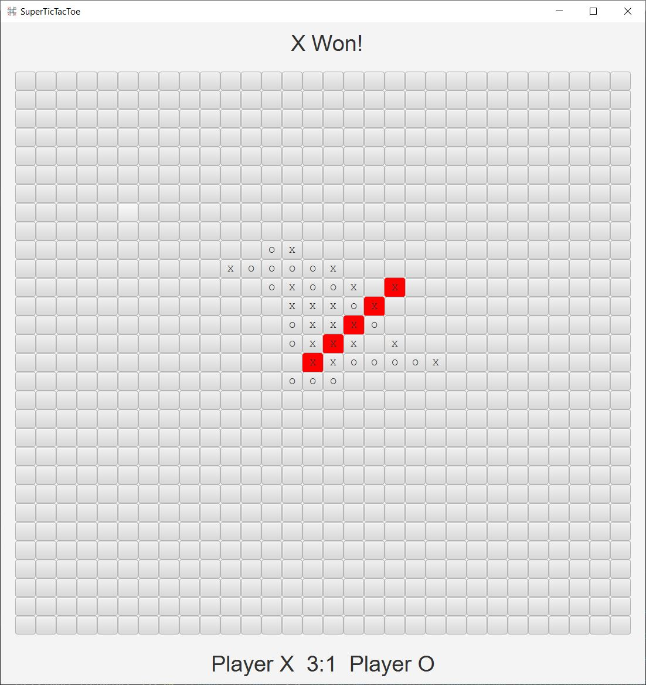

# JavaFX-SuperTicTacToe
A more complex game of TicTacToe made using the JavaFX library.

## Game Description
A spin of the clasic tictactoe game that uses a 30x30 grid and the winning pattern is 5 of the same symbol(X or O) placed consecutively wither vertically, horizontally or diagonally. The winning pattern is highlighted in red when a player wins and the winner is announced at the top of the screen. The score is kept at the bottom of the screen. The game features a main menu that is brought on the screen when the player presses ESC. The menu has 4 buttons: resume game, restart the current game, reset the score and quit the game.

## Game Screenshots
A random gamestate

A game over gamestate

The main menu

